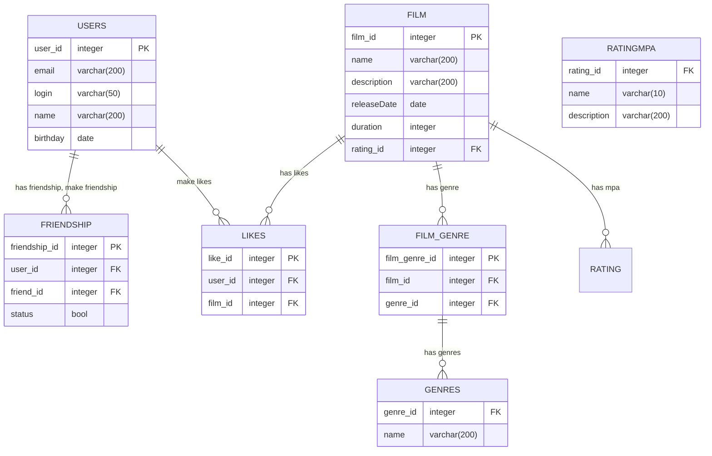

# java-filmorate

Template repository for Filmorate project.

## ER-diagram
---



---

## Examples of SQL query:<br>

- Ex.1 (top 10 films by likes):<br>

```sql
 SELECT g.genre_id, 
        name 
 FROM Genre AS g
 INNER JOIN Film_genre AS fg on g.genre_id = fg.genre_id
 WHERE fg.film_id = 2;
```

- Ex.2 (Take id and login friends by user with id = 1):<br>

```sql
 SELECT u.user_id,
        u.login
 FROM Users AS u
 WHERE u.user_id IN (SELECT fr.friend_id
                     FROM Frendship AS fr
                     WHERE fr.user_id = 1);
```
       

