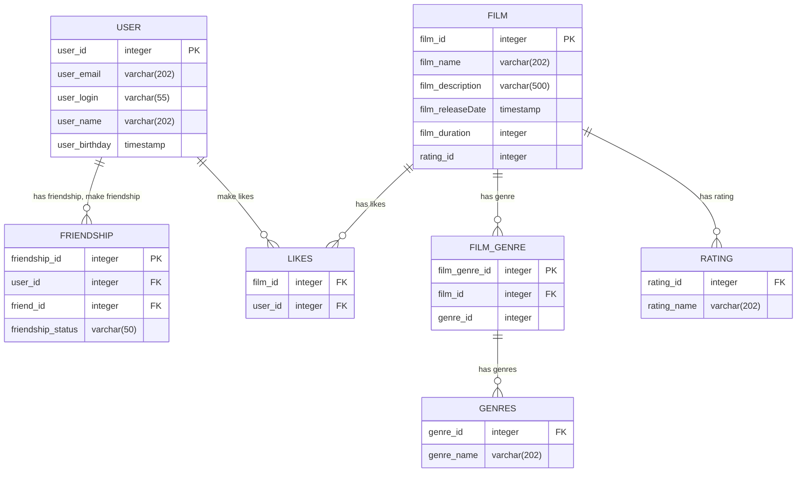

# java-filmorate

Template repository for Filmorate project.

## ER-diagram
---

---
## Examples of SQL query:<br>
 - Ex.1 (top 10 films by likes):<br>
```sql
 SELECT name
 FROM film
 WHERE film_id IN (SELECT film_id
                   FROM likes
                   GROUP BY film_id
                   ORDER BY COUNT(user_id) DESC
                   LIMIT 10);
```

 - Ex.2 (Take id and login friends by user with id = 1):<br>
```sql
 SELECT u.user_id,
        u.login
 FROM user AS u
 WHERE u.user_id IN (SELECT uf.friend_id
                     FROM user_friends AS uf
                     WHERE uf.user_id = 1);
```
       

